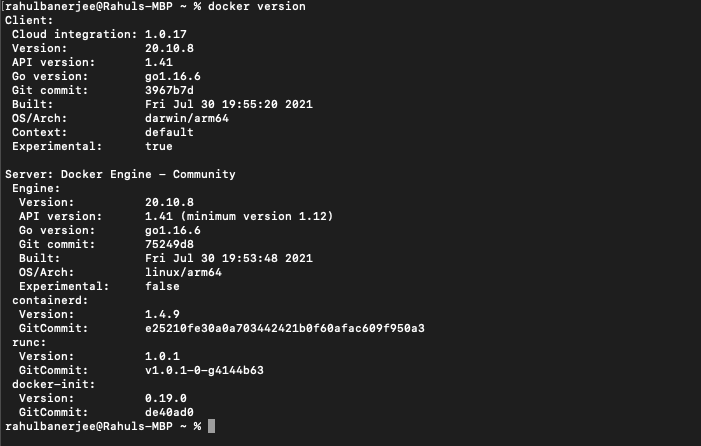
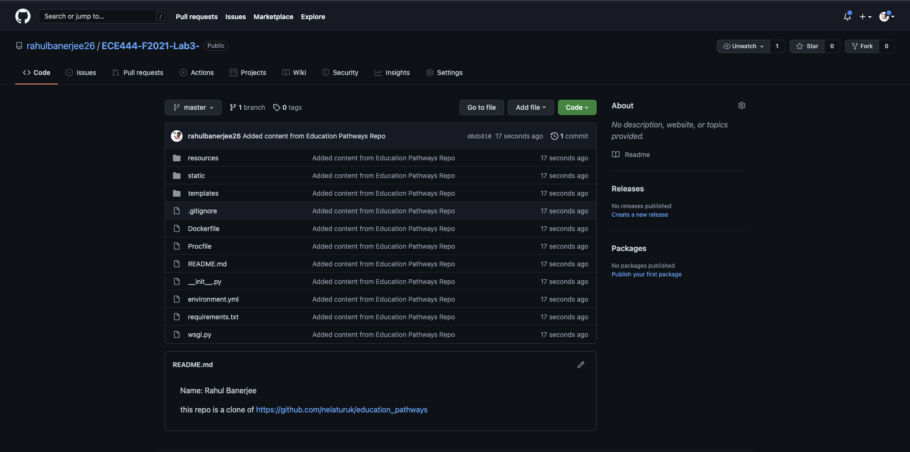
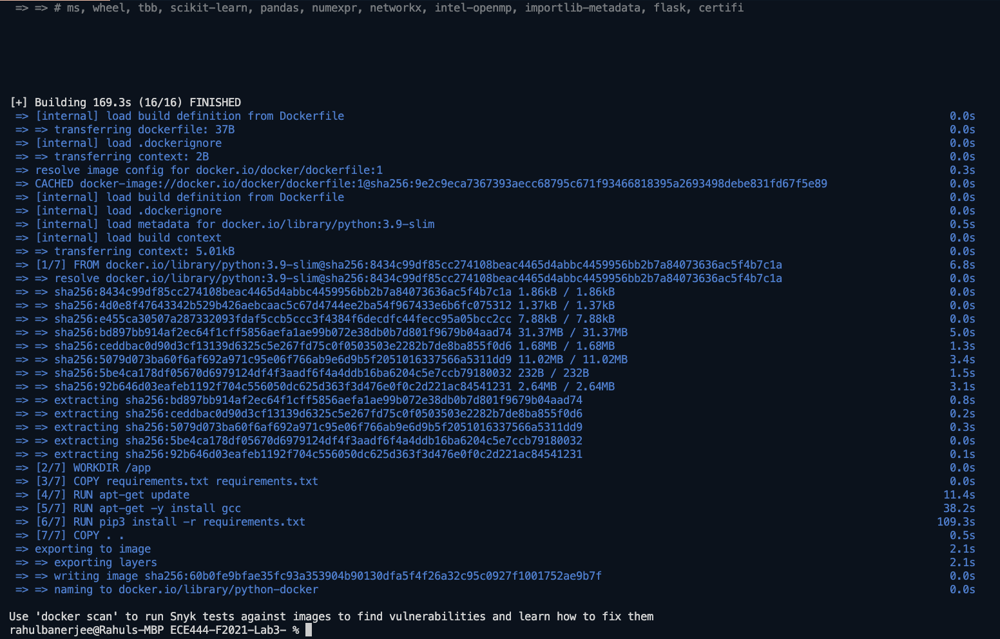
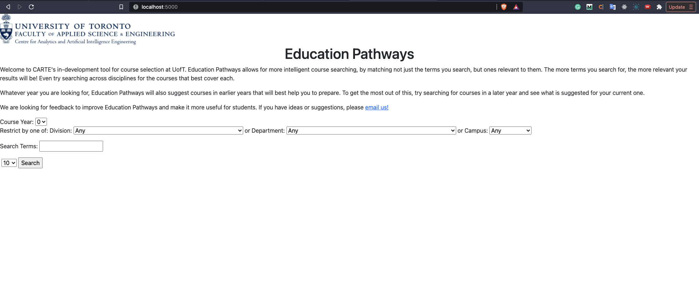
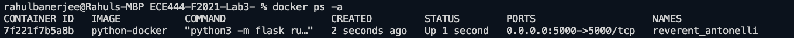
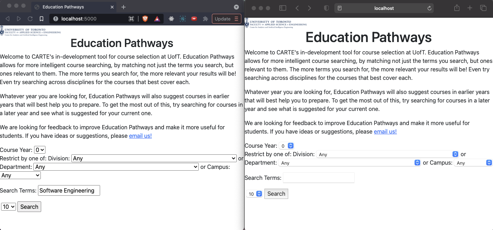

Name: Rahul Banerjee

this repo is a clone of https://github.com/nelaturuk/education_pathways'

### Activity 1

### Activity 2

### Activity 3

### Activty 4

#### Localhost

#### Docker Image

### Activity 5

#### Functional Requirement
I'd like to include an autocomplete feature. Right now, I have to type the entire course keyword and sometimes there are no results shown when I type the keyword. I would like to have the search engine suggest ketwords or autocomplete my keyword. This would reduce the words I have to type and also let me know if I am typing the wrong keyword.

#### Non Functional Requirement

On the left is the application running on brave browser and on the right, the application is running on safari. There are minor differences in the UI, the boxes in safari have round-edges with a slight shadow. The arrows have a blue color and use a different style. I would like to keep the UI consistant across different browsers.

